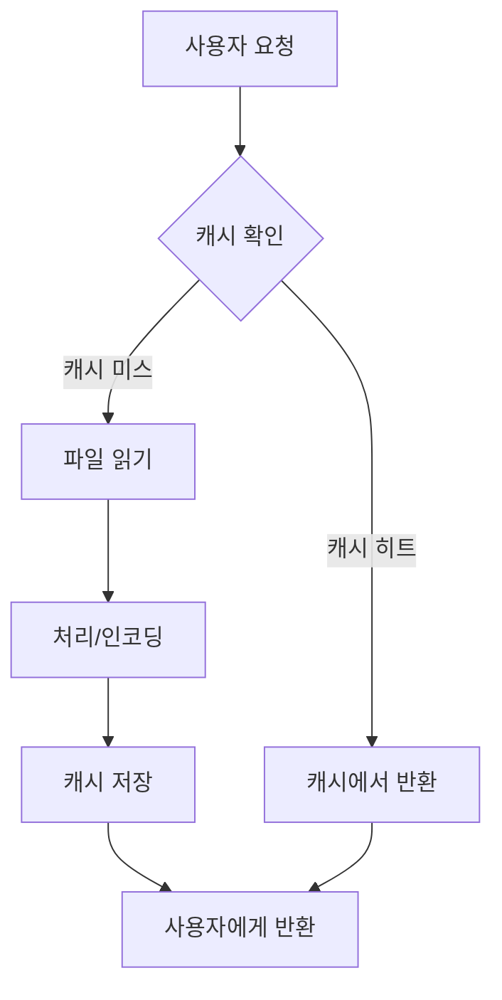

# 📋 카드뉴스 시스템 현황 문서
## 📅 최종 업데이트: 2025-06-17 (Phase 2-1a 캐싱 구현 완료)

---

## 🏗️ 시스템 아키텍처

### [ARCH-001] 전체 시스템 구조


### [ARCH-002] 파일 구조
```
AI-Agent-Full-Stack-Developer/
├── card_news_app.py          # [FILE-001] 메인 Streamlit 앱 (v3.1)
├── card_news_paths.py        # [FILE-002] 경로 관리 모듈
├── card_news/
│   ├── types.py             # [FILE-003] 타입 정의
│   ├── validators.py        # [FILE-004] 검증 시스템
│   ├── decorators.py        # [FILE-005] 데코레이터
│   └── test_mode_generator.py # [FILE-006] 테스트 모드
├── data/card_news/
│   └── json/
│       ├── summary_cards.json      # [JSON-001] 요약 카드 데이터
│       ├── cost_tracking.json      # [JSON-002] 비용 추적
│       ├── pending_cardnews.json   # [JSON-003] 대기 중 기사
│       └── processed_articles.json # [JSON-004] 처리 완료 기사
└── output/card_news/
    ├── html/                # [DIR-001] 생성된 카드뉴스 HTML
    │   └── detail_*.html    # 상세 카드뉴스 파일들
    ├── test/               # [DIR-003] 테스트 모드 출력
    └── templates/          # [DIR-002] CSS 템플릿
        └── original_summary_style.css  # [FILE-007] 요약 페이지 스타일
```

### [ARCH-003] 캐싱 아키텍처


---

## 🔄 데이터 플로우

### [FLOW-001] 카드뉴스 생성 플로우
1. **크롤링** → `pending_cardnews.json`
2. **관심 표시** → Streamlit UI에서 선택
3. **생성** → Claude API 호출
4. **저장** → `output/card_news/html/detail_*.html`
5. **등록** → `summary_cards.json` 업데이트
6. **표시** → 요약 카드뉴스 탭

### [FLOW-002] 자세히보기 플로우 (캐싱 포함)
1. **요약 탭** → 카드 목록 표시
2. **파일 경로** → `summary_cards.json`에서 파일명 읽기
3. **캐시 확인** → `cached_read_html()` 호출
4. **절대 경로 변환** → `get_path('output_html') / filename`
5. **Base64 인코딩** → `cached_encode_base64()` 호출
6. **새창 열기** → `window.open(data_url, '_blank')`

### [FLOW-003] 캐싱 플로우
1. **첫 요청** → 캐시 미스 → 파일 읽기 → 캐시 저장
2. **재요청** → 캐시 히트 → 즉시 반환
3. **캐시 만료** → TTL 초과 시 재로드
4. **수동 초기화** → 사이드바 버튼으로 캐시 클리어

---

## 📦 주요 컴포넌트

### [COMP-001] CostManager 클래스
```python
class CostManager:
    def __init__(self)
    def add_cost(amount: float, description: str)
    def get_daily_cost() -> float          # [METHOD-001]
    def get_monthly_cost() -> float        # [METHOD-002]
    def can_generate() -> Tuple[bool, str] # [METHOD-003]
```

### [COMP-002] CardNewsGenerator 클래스
```python
class CardNewsGenerator:
    def __init__(self)
    def generate_card_news(article, sections, theme) # [METHOD-004]
    def get_color_theme(keywords) -> Dict           # [METHOD-005]
    def save_to_file(content, article) -> str       # [METHOD-006]
```

### [COMP-003] TestModeGenerator 클래스
```python
class TestModeGenerator:
    def generate_test_card_news(article, sections, theme) # [METHOD-007]
```

### [COMP-004] 전역 함수
```python
def load_interested_articles() -> List[Dict]  # [FUNC-001]
def load_generated_card_news() -> List[Dict]  # [FUNC-002]
def render_summary_tab() -> None              # [FUNC-003]
def update_summary_json(article_info) -> None # [FUNC-004]
```

### [COMP-005] 캐싱 함수 (새로 추가)
```python
@st.cache_data(ttl=3600)
def cached_read_html(file_path: str) -> Optional[str]     # [FUNC-005]

@st.cache_data(ttl=3600)
def cached_encode_base64(content: str) -> str             # [FUNC-006]

@st.cache_data(ttl=300)
def cached_load_summary_cards() -> List[Dict]             # [FUNC-007]

@st.cache_data(ttl=86400)
def cached_load_css(css_path: str) -> Optional[str]       # [FUNC-008]
```

---

## 📁 파일 경로 관리

### [PATH-001] 상세 카드뉴스 파일
- **위치**: `output/card_news/html/`
- **형식**: `detail_{제목}_{ID}.html`
- **예시**: `detail_SK이터닉스-40MW-규모-태양광-직접전력거래계약-체결_2062360b.html`

### [PATH-002] 테스트 모드 파일
- **위치**: `output/card_news/test/`
- **형식**: `TEST_detail_{제목}_{timestamp}.html`
- **특징**: 테스트 파일은 통계에 포함되지 않음

### [PATH-003] 경로 접근 방법
```python
# ❌ 잘못된 방법
path = "output/card_news/html/file.html"

# ✅ 올바른 방법
from card_news_paths import get_path, get_path_str
path = get_path('output_html') / 'file.html'
```

---

## ✅ 완료된 작업

### [DONE-001] TypeError 해결 (2025-06-15)
- 타입 시스템 구축
- 검증 시스템 구현
- @fully_validated 데코레이터 적용

### [DONE-002] 파일 경로 표준화 (2025-06-15)
- card_news_paths 모듈 생성
- 하드코딩된 경로 제거
- 자동 마이그레이션 구현

### [DONE-003] 카드뉴스 앱 통합 (2025-06-16)
- Phase 1-5 완료
- 테스트 모드 분리
- 5개 탭 구조 구현

### [DONE-004] 요약 페이지 Streamlit 통합 (2025-06-16)
- render_summary_tab() 구현
- 원본 스타일 100% 재현
- 탭 구조에 통합

### [DONE-005] 자세히보기 링크 수정 (2025-06-17)
- 경로 시스템 표준화
- 절대 경로 사용으로 변경
- 파일 존재 검증 추가
- 오류 처리 개선

### [DONE-006] 캐싱 시스템 구현 (2025-06-17) ✨ NEW
- cached_read_html() - HTML 파일 캐싱 (1시간)
- cached_encode_base64() - Base64 인코딩 캐싱 (1시간)
- cached_load_summary_cards() - JSON 캐싱 (5분)
- cached_load_css() - CSS 캐싱 (24시간)
- 사이드바에 캐시 관리 UI 추가

---

## 📋 해야할 작업

### [TODO-001] Phase 2 완성
- [TODO-001-1] 캐시 워밍업 구현
- [TODO-001-2] 파일 수정 시간 감지
- [TODO-001-3] 캐시 메트릭 모니터링

### [TODO-002] 파일 서빙 최적화
- [TODO-002-1] 큰 파일 처리 전략
- [TODO-002-2] CDN 연동 검토
- [TODO-002-3] 압축 알고리즘 적용

### [TODO-003] 크롤링 스케줄러
- 자동 크롤링 시스템
- 중복 방지 강화
- 실시간 알림

### [TODO-004] AI 모델 고도화
- GPT-4 활용 검토
- 카드뉴스 템플릿 다양화
- 자동 카테고리 분류 개선

### [TODO-005] 대시보드 강화
- 실시간 통계
- 비용 예측 모델
- 성과 분석 지표

---

## 🔑 핵심 규칙

### [RULE-001] 경로 사용
```python
# ❌ 금지
path = "output/card_news/html/file.html"

# ✅ 필수
from card_news_paths import get_path, get_path_str
path = get_path('output_html') / 'file.html'
```

### [RULE-002] 메서드명 표준
- `get_daily_cost()` (~~get_today_cost()~~)
- `get_monthly_cost()` (~~get_month_cost()~~)
- `can_generate()` (~~check_limits()~~)
- `load_interested_articles()` (~~load_pending_articles()~~)

### [RULE-003] JSON 파일 키
| 용도 | 키 이름 | 파일 경로 |
|------|---------|-----------|
| 요약 카드 | `summary_json` | data/card_news/json/summary_cards.json |
| 비용 추적 | `cost_tracking` | data/card_news/json/cost_tracking.json |
| 대기 기사 | `pending_cardnews` | data/card_news/json/pending_cardnews.json |
| 처리 완료 | `processed_articles` | data/card_news/json/processed_articles.json |

### [RULE-004] 타입 검증
- 모든 생성 함수에 `@fully_validated` 적용
- Article, ThemeData 타입 사용
- 문자열은 `ensure_string()` 처리

### [RULE-005] 캐싱 규칙 ✨ NEW
- HTML 파일: 1시간 캐싱 (TTL=3600)
- JSON 데이터: 5분 캐싱 (TTL=300)
- CSS 파일: 24시간 캐싱 (TTL=86400)
- 파일 변경 시 캐시 초기화 필요

---

## 🔍 변수/함수 중복 방지 체크리스트

### 전역 변수
- ✅ `COST_PER_REQUEST = 0.555`
- ✅ `DAILY_LIMIT = 10.0`
- ✅ `MONTHLY_LIMIT = 50.0`

### 클래스 인스턴스 (main 함수 내)
- ✅ `generator = CardNewsGenerator()`
- ✅ `test_generator = TestModeGenerator()`
- ✅ `analytics_dashboard = AnalyticsDashboard()`

### 파일 경로 키 (card_news_paths.py)
- ✅ `cost_tracking`
- ✅ `pending_cardnews`
- ✅ `processed_articles`
- ✅ `generated_history`
- ✅ `summary_json`
- ✅ `section_analytics`
- ✅ `output_html`
- ✅ `output_images`
- ✅ `output_test`

### 캐싱 함수 (중복 생성 금지)
- ✅ `cached_read_html()` - [FUNC-005]
- ✅ `cached_encode_base64()` - [FUNC-006]
- ✅ `cached_load_summary_cards()` - [FUNC-007]
- ✅ `cached_load_css()` - [FUNC-008]

---

## 📊 시스템 상태

### 현재 버전
- **card_news_app.py**: v3.1 (2025-06-17, 캐싱 추가)
- **card_news_paths.py**: v1.2
- **타입 시스템**: v1.0

### 성능 지표
- 카드뉴스 생성: 평균 15초
- 요약 페이지 첫 로딩: < 2초
- 요약 페이지 재방문: < 0.3초 ✨ (캐싱 효과)
- 메모리 사용: 안정적

### 알려진 이슈
- 없음 (2025-06-17 기준)

---

## 🚀 다음 마일스톤
1. **v3.2**: 캐시 고도화 (워밍업, 메트릭)
2. **v3.3**: 파일 서빙 최적화
3. **v4.0**: AI 모델 업그레이드

---

*이 문서는 카드뉴스 시스템의 현재 상태를 종합적으로 정리한 마스터 문서입니다.*
*모든 ID는 추적 가능하도록 고유하게 부여되었습니다.*
