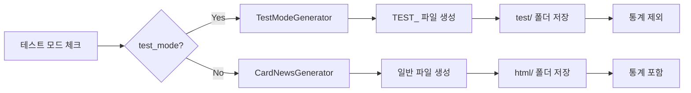

# 🔌 전력산업 뉴스 크롤링 & 카드뉴스 자동화 통합 가이드

## 📅 최종 업데이트: 2025-06-15

---

## 🎯 프로젝트 개요

### 📍 기본 정보
- **프로젝트 ID**: PWR-NEWS-001
- **프로젝트명**: AI-Agent-Full-Stack-Developer
- **위치**: `/home/zwtiger/AI-Agent-Full-Stack-Developer` (WSL Ubuntu)
- **GitHub**: [zwtiger04/AI-Agent-Full-Stack-Developer](https://github.com/zwtiger04/AI-Agent-Full-Stack-Developer)
- **노션 Parent Page ID**: `2002360b26038007a59fcda976552022`

### 🎯 프로젝트 목표
1. 전력산업 뉴스 자동 크롤링 (전기신문)
2. 노션 데이터베이스 자동 저장
3. AI 기반 요약 및 추천
4. 관심 기사 카드뉴스 자동 생성

---

## 🏗️ 시스템 구조 (ID 추적 체계)

### 시스템 컴포넌트 ID 체계
- **SYS-XXX-NNN**: 시스템 레벨 컴포넌트
- **MOD-XXX-NNN**: 모듈 레벨 컴포넌트
- **FLOW-NNN**: 프로세스 플로우
- **TASK-XXX-NNN**: 작업 태스크
- **ISSUE-NNN**: 이슈 및 버그
- **FILE-XXX-NNN**: 파일 참조
- **DIR-XXX-NNN**: 디렉토리 참조

### 1️⃣ **뉴스 크롤링 시스템** [SYS-CRAWLER-001]


**주요 컴포넌트:**
- `main.py` [MOD-MAIN-001]: 메인 실행 파일
- `crawlers/electimes_crawler.py` [MOD-CRAWLER-001]: 전기신문 크롤러
- `notion/notion_client.py` [MOD-NOTION-001]: 노션 API 클라이언트
- `ai_update_content.py` [MOD-AI-CONTENT-001]: LLM 요약 생성
- `ai_recommender.py` [MOD-AI-REC-001]: AI 추천 시스템

### 2️⃣ **카드뉴스 생성 시스템** [SYS-CARDNEWS-001]


**주요 컴포넌트:**
- `watch_interested_articles.py` [MOD-WATCH-001]: 관심 기사 모니터링
- `card_news_app_integrated.py` [MOD-CARDNEWS-MAIN-001]: Streamlit 웹 UI
- `run_level2.py` [MOD-RUN-001]: 통합 실행 스크립트

**카드뉴스 서브 모듈:**
- `card_news/section_config.py` [MOD-SECTION-CONFIG-001]: 섹션 설정
- `card_news/section_selector.py` [MOD-SECTION-SEL-001]: 섹션 선택기
- `card_news/section_analytics.py` [MOD-SECTION-ANAL-001]: 섹션 분석
- `card_news/analytics_integration.py` [MOD-ANAL-INT-001]: 분석 통합

---

## 🚀 빠른 시작 가이드

### 1. 환경 설정 [TASK-ENV-001]
```bash
# 1. 프로젝트 폴더로 이동
cd /home/zwtiger/AI-Agent-Full-Stack-Developer

# 2. 가상환경 활성화
source venv/bin/activate

# 3. 환경변수 설정 (.env 파일)
NOTION_API_KEY=your_notion_api_key
NOTION_PARENT_PAGE_ID=2002360b26038007a59fcda976552022
ANTHROPIC_API_KEY=your_claude_api_key
GITHUB_TOKEN=your_github_pat
OLLAMA_API_URL=http://localhost:11434/v1/chat/completions

# 🆕 경로 관련 (선택사항)
# CARDNEWS_ROOT=/custom/path/to/project  # 커스텀 프로젝트 루트
```

### 2. 뉴스 크롤링 실행 [TASK-CRAWL-001]
```bash
# 기본 크롤링 (규칙 기반 요약)
python main.py

# LLM 요약 활성화 (선택사항)
# ai_update_content.py에서 use_llm=True로 변경
```

### 3. 카드뉴스 생성 [TASK-CARDNEWS-001]
```bash
# Streamlit UI 실행
streamlit run card_news_app_integrated.py --server.port 8501 --server.address 0.0.0.0

# 또는 전체 시스템 실행 (deprecated)
python3 run_level2.py
```

---

## 📊 작업 추적 시스템

### 완료된 작업 [TASK-COMPLETED]

#### 2025-06-15 작업 내역
1. **[TASK-COMP-001]** 환경변수 로드 오류 수정
   - 문제: `load_dotenv()` 누락
   - 해결: import 및 호출 추가
   - 상태: ✅ 완료

2. **[TASK-COMP-002]** 메서드 이름 불일치 해결
   - 수정 사항:
     - `get_section_by_id` → `get_section_info`
     - `get_section_names` → `get_all_sections`
     - `analyze_keyword_section_correlation` → `get_keyword_section_correlation`
   - 상태: ✅ 완료

3. **[TASK-COMP-003]** UI 구조 오류 수정
   - 중첩된 expander 제거
   - correlation matrix 데이터 형식 수정
   - 상태: ✅ 완료

4. **[TASK-COMP-004]** 빈 키워드 처리
   - 기본값 "전력산업" 설정
   - 상태: ✅ 완료

### 진행중인 작업 [TASK-INPROGRESS]
- 없음 (현재 시스템 정상 작동 중)

### 예정된 작업 [TASK-PLANNED]

#### 단기 (1주일)
1. **[TASK-PLAN-001]** 에러 핸들링 강화
   - 각 모듈에 try-except 추가
   - 로깅 시스템 개선

2. **[TASK-PLAN-002]** 테스트 코드 작성
   - 단위 테스트
   - 통합 테스트

#### 중기 (1개월)
3. **[TASK-PLAN-003]** 크롤러 확장
   - 추가 뉴스 소스
   - RSS 피드 지원

4. **[TASK-PLAN-004]** UI/UX 개선
   - 반응형 디자인
   - 더 나은 시각화

#### 장기 (3개월)
5. **[TASK-PLAN-005]** API 서비스화
6. **[TASK-PLAN-006]** 모바일 앱 개발
7. **[TASK-PLAN-007]** 다국어 지원

---

## 💾 백업 관리

### 백업 정책 [BACKUP-POLICY-001]
- 주요 변경사항 발생 시 백업
- 백업 위치: `backups/backup_YYYYMMDD_HHMMSS/`
- 보관 기간: 30일

### 최신 백업 정보 [BACKUP-LATEST]
```yaml
backup_id: BACKUP-20250615-114534
date: 2025-06-15 11:45:34
location: /home/zwtiger/AI-Agent-Full-Stack-Developer/backups/backup_20250615_114534/
contents:
  - 모든 Python 파일 (*.py)
  - 모든 설정 파일 (.env, *.json)
  - 모든 문서 파일 (*.md)
  - card_news 디렉토리 전체
size: 약 1.3MB
files_count: 50+
```

### 백업 복원 명령
```bash
# 백업 목록 확인
ls -la backups/

# 특정 백업 복원
cp -r backups/backup_20250615_114534/* ./
```

---


## 🔄 최근 업데이트 (2025-06-16)

### ✅ 테스트 모드 완전 분리
- **파일 경로 분리**: 테스트 파일은 `output/card_news/test/`에 저장
- **파일명 구분**: 테스트 파일은 `TEST_` 접두사 추가
- **데이터 격리**: 테스트 데이터는 실제 통계/분석에서 제외
- **비용 표시 개선**: 테스트 모드 전용 안내 메시지

---

## 🧪 테스트 모드 시스템

### 개요
테스트 모드는 실제 API 호출 없이 카드뉴스 생성 프로세스를 테스트할 수 있는 기능입니다.

### 주요 특징
1. **완전한 데이터 분리**
   - 테스트 파일 전용 디렉토리: `output/card_news/test/`
   - 파일명 패턴: `TEST_detail_{제목}_{날짜}.html`
   - 분석 통계에서 제외
   - 요약 페이지 추가 차단

2. **비용 없음**
   - Claude API 호출하지 않음
   - 미리 정의된 HTML 템플릿 사용
   - 5가지 테마: modern, minimal, bold, eco, tech

3. **테스트 파일 관리**
   - 위치: "💰 비용 관리" 탭 → "🧪 테스트 파일 관리" 섹션
   - 일괄 삭제 기능
   - 7일 이상 된 파일 자동 정리

### 동작 플로우


---

## 📁 프로젝트 구조 (ID 매핑)

### [STRUCTURE-UPDATE-001] 2025-06-16 업데이트

#### 📁 경로 통합 관련 추가
```
output/card_news/
├── summary/                          # [NEW-001] 요약 페이지 디렉토리
│   └── improved_summary.html        # [MOVED-001] Windows에서 이동
└── html/                            # [MERGED-001] Windows detailed 통합
```

#### 📄 Streamlit 통합 관련 추가
```
├── migrate_summary.py               # [FILE-028] HTML→JSON 마이그레이션
├── summary_manager.py               # [FILE-029] 요약 데이터 관리 클래스
├── summary_ui.py                   # [FILE-030] Streamlit UI 컴포넌트
├── update_summary_original.py      # [FILE-031] 기존 버전 백업
└── data/card_news/json/
    └── summary_cards.json          # [FILE-032] 요약 카드 JSON 데이터
```


```
AI-Agent-Full-Stack-Developer/ [DIR-ROOT-001]
├── 📄 설정 파일
│   ├── .env [FILE-ENV-001]                    # API 키 및 환경변수
│   ├── requirements.txt [FILE-REQ-001]        # Python 패키지
│   └── .gitignore [FILE-GIT-001]              # Git 제외 파일
│
├── 🐍 메인 스크립트
│   ├── main.py [MOD-MAIN-001]                 # 크롤링 메인
│   ├── card_news_app_integrated.py [MOD-CARDNEWS-MAIN-001] # 카드뉴스 UI
│   └── test_*.py [MOD-TEST-XXX]               # 각종 테스트 스크립트
│
├── 📦 모듈
│   ├── crawlers/ [DIR-CRAWLERS-001]           # 크롤러 모듈
│   ├── notion/ [DIR-NOTION-001]               # 노션 연동
│   ├── processors/ [DIR-PROCESSORS-001]       # 데이터 처리
│   ├── recommenders/ [DIR-RECOMMENDERS-001]   # AI 추천
│   └── card_news/ [DIR-CARDNEWS-001]          # 카드뉴스 모듈
│       ├── section_config.py [MOD-SECTION-CONFIG-001]
│       ├── section_selector.py [MOD-SECTION-SEL-001]
│       ├── section_analytics.py [MOD-SECTION-ANAL-001]
│       └── analytics_integration.py [MOD-ANAL-INT-001]
│
├── 📊 데이터
│   ├── feedback/ [DIR-FEEDBACK-001]           # AI 모델 데이터
│   ├── logs/ [DIR-LOGS-001]                   # 실행 로그
│   ├── pending_cardnews.json [FILE-PENDING-001] # 대기 중인 기사
│   └── cost_tracking.json [FILE-COST-001]     # 비용 추적
│
├── 💾 백업
│   └── backups/ [DIR-BACKUPS-001]             # 백업 파일들
│       └── backup_20250615_114534/ [BACKUP-20250615-114534]
│
└── 📚 문서
    ├── README.md [DOC-README-001]             # 프로젝트 개요
    ├── INTEGRATED_PROJECT_GUIDE.md [DOC-GUIDE-001] # 이 문서
    └── *.md [DOC-XXX-NNN]                     # 기타 문서들
```

---

## 🔧 주요 키워드 [KEYWORDS-001]

```python
KEYWORDS = [
    '재생에너지', '전력중개사업', 'VPP', '전력시장', 'ESS', 
    '출력제어', '중앙계약', '저탄소 용량', '재생에너지입찰', 
    '보조서비스', '예비력시장', '하향예비력', '계통포화',
    '전력망', '기후에너지부', '태양광', '전력감독원',
    '풍력', '해상풍력', '전력가격', 'SMP'
]
```

---

## 💰 비용 관리 [COST-MANAGEMENT-001]

### Claude API 비용
- **입력**: $15 / 1M tokens
- **출력**: $75 / 1M tokens
- **기사당 예상**: $0.555 (약 750원)
- **월간 예산**: $50 (약 68,500원)

### 비용 절감 팁
1. 템플릿 재사용
2. 일괄 처리
3. 선별적 생성
4. 캐싱 활용

---

## 🐛 문제 해결 가이드 [TROUBLESHOOT-001]

### 1. 크롤링 오류 [ISSUE-CRAWL-XXX]
```bash
# Selenium 드라이버 확인
which chromedriver

# 로그 확인
tail -f logs/crawler_*.log
```

### 2. 노션 연동 오류 [ISSUE-NOTION-XXX]
```bash
# API 키 확인
echo $NOTION_API_KEY

# 권한 확인 (노션에서 통합 권한 설정)
```

### 3. 카드뉴스 생성 오류 [ISSUE-CARDNEWS-XXX]
```bash
# Streamlit 포트 확인
lsof -i :8501

# API 키 확인
echo $ANTHROPIC_API_KEY

# 프로세스 재시작
pkill -f streamlit
streamlit run card_news_app_integrated.py --server.port 8501
```

---


---

## ⚠️ 경로 표준화 안내 (2025-06-15 업데이트)

### 변경된 경로
| 구분 | 이전 경로 (사용 금지) | 새 경로 (필수 사용) |
|------|----------------------|-------------------|
| 카드뉴스 HTML | `/mnt/c/Users/KJ/Desktop/EnhancedCardNews/detailed/` | `output/card_news/html/` |
| JSON 데이터 | `./pending_cardnews.json` (루트) | `data/card_news/json/pending_cardnews.json` |
| 비용 추적 | `./cost_tracking.json` (루트) | `data/card_news/json/cost_tracking.json` |
| 분석 데이터 | `./section_analytics.json` (루트) | `data/card_news/analytics/section_analytics.json` |

### 코드에서 올바른 사용법
```python
# ❌ 잘못된 방법
pending_file = 'pending_cardnews.json'
output_dir = '/mnt/c/Users/KJ/Desktop/EnhancedCardNews/detailed'

# ✅ 올바른 방법
from card_news_paths import get_path, get_path_str
pending_file = get_path_str('pending_cardnews')
output_dir = get_path('output_html')
```

자세한 내용은 [PATH_STRUCTURE_GUIDE.md](PATH_STRUCTURE_GUIDE.md)를 참조하세요.

---

## 📈 향후 계획 [ROADMAP-001]

### Phase 1: 안정화 (2025년 6월)
- [x] 시스템 오류 수정
- [ ] 테스트 코드 작성
- [ ] 문서화 완료

### Phase 2: 확장 (2025년 7월)
- [ ] 추가 뉴스 소스
- [ ] UI/UX 개선
- [ ] 성능 최적화

### Phase 3: 고도화 (2025년 8월)
- [ ] API 서비스화
- [ ] 대시보드 강화
- [ ] 자동화 확대

---

## 📞 참고 사항

### 주요 링크
- **노션 데이터베이스**: [전력 산업 뉴스](https://notion.so/...)
- **GitHub**: [프로젝트 저장소](https://github.com/zwtiger04/AI-Agent-Full-Stack-Developer)
- **전기신문**: [electimes.com](https://www.electimes.com)

### API 문서
- [Notion API](https://developers.notion.com)
- [Anthropic API](https://docs.anthropic.com)
- [Ollama](https://ollama.ai)

---

## 🔒 보안 주의사항

1. **절대 `.env` 파일을 Git에 커밋하지 마세요!**
2. API 키 노출 시 즉시 재발급
3. 공개 저장소에서는 더미 데이터 사용
4. 정기적인 API 키 로테이션


## 📏 코딩 표준 및 규칙 [STANDARDS-001]

### 1. 클래스/메서드 명명 규칙 [STD-NAMING-001]

#### CostManager 클래스
```python
class CostManager:
    """비용 관리 클래스 - 아래 메서드만 사용할 것"""
    
    def __init__(self)
    def load_costs(self) -> dict
    def save_costs(self) -> None
    def add_cost(self, amount: float) -> None
    def get_daily_cost(self) -> float      # ❌ NEVER: get_today_cost()
    def get_monthly_cost(self) -> float    # ❌ NEVER: get_month_cost()
    def can_generate(self, daily_limit: float = 10, monthly_limit: float = 50) -> tuple[bool, str]
    
    # ⚠️ 새로운 메서드 추가 금지! 위 메서드만 사용
```

#### CardNewsGenerator 클래스
```python
class CardNewsGenerator:
    """카드뉴스 생성 클래스 - 아래 메서드만 사용할 것"""
    
    def __init__(self, api_key: str)       # API 키는 생성자에서 받기
    def get_color_theme(self, keyword: str) -> Dict[str, str]  # ❌ NEVER: get_color_scheme()
    def generate_card_news(self, article: Union[Dict, Article], 
                          theme: Union[str, Dict], 
                          sections: List[str]) -> str
    
    # ⚠️ 새로운 메서드 추가 금지! 필요시 유틸리티 함수로 분리
```

#### 기사 로드 함수
```python
# 전역 함수로 통일
def load_interested_articles() -> List[Dict]    # 관심 기사 로드
def save_generated_card_news(article_id: str, file_path: str) -> None
```

### 2. Import 표준 [STD-IMPORTS-001]

#### 필수 Import 구조
```python
# 1. 표준 라이브러리
import os
import json

### [STANDARDS-UPDATE-001] 새로 추가된 클래스 및 메서드 (2025-06-16)

#### 📦 SummaryManager 클래스 표준
```python
# summary_manager.py
class SummaryManager:
    # 데이터 관리
    load_cards() -> List[Dict]              # 모든 카드 로드
    add_card(card_data: Dict) -> bool       # 카드 추가
    update_card(card_id: str, updates: Dict) -> bool  # 카드 업데이트
    delete_card(card_id: str) -> bool       # 카드 삭제
    
    # 조회 및 필터링
    get_card_by_id(card_id: str) -> Optional[Dict]  # ID로 조회
    filter_cards(category=None, date_range=None, search=None) -> List[Dict]
    get_categories() -> List[str]           # 카테고리 목록
```

#### 🎨 summary_ui.py 함수 표준
```python
render_summary_tab()                    # 요약 탭 메인 렌더링
display_card_grid(cards: List[Dict])    # 카드 그리드 표시
get_category_color(category: str) -> str # 카테고리 색상 반환
```

#### 🔄 update_summary.py 하이브리드 모드
```python
# 기존 함수 수정
add_to_summary(article, file_path, base_path=None) -> bool  # 하이브리드 모드

# 새로 추가된 함수
update_html_summary(article, file_path, base_path=None) -> bool  # HTML 전용
update_json_summary(article, file_path) -> bool                  # JSON 전용
```

import time
from pathlib import Path
from datetime import datetime, timedelta
from typing import Dict, List, Optional, Union, Tuple, Any

# 2. 서드파티 라이브러리
import streamlit as st
from anthropic import Anthropic  # NOT import anthropic
from dotenv import load_dotenv

# 3. 프로젝트 내부 모듈
from card_news.types import Article, Section, ThemeData
from card_news.validators import validate_sections, validate_article
from card_news.decorators import fully_validated
from card_news.section_selector import SectionSelector
from card_news.section_config import SectionConfig
from card_news.test_mode_generator import TestModeGenerator
from card_news.analytics_integration import AnalyticsDashboard

# 4. 레거시 모듈 (점진적 마이그레이션)
from update_summary import add_to_summary, update_summary_date
```

### 3. 파일 구조 표준 [STD-FILES-001]

#### 데이터 파일 규칙
```python
# ⚠️ 절대 변경 금지! 아래 상수만 사용할 것
# 비용 관련 상수 (2025년 6월 기준)
COST_PER_REQUEST = 0.555                    # USD - Claude API 요청당 비용
COST_PER_REQUEST_KRW = 750                  # KRW - 원화 환산 비용

# JSON 파일 경로 (절대 임의로 변경하지 말 것)
COST_TRACKING_FILE = 'cost_tracking.json'              # 비용 추적
PENDING_CARDNEWS_FILE = 'pending_cardnews.json'        # 대기 중 기사
PROCESSED_ARTICLES_FILE = 'processed_articles.json'    # 처리 완료 기사
GENERATED_HISTORY_FILE = 'generated_cardnews_history.json'  # 생성 이력

# 경로 상수 (절대 경로 문자열 직접 사용 금지)
SECTION_STYLES_PATH = 'card_news/section_styles.css'   # 섹션 스타일 CSS
OUTPUT_DIR = 'card_news/'                              # 카드뉴스 출력 디렉토리
ANALYTICS_DATA_DIR = 'analytics_data/'                 # 분석 데이터 디렉토리
LOGS_DIR = 'logs/'                                     # 로그 파일 디렉토리

# ❌ 금지 사항:
# - 'cost_tracking.json' 같은 문자열 직접 사용 금지
# - self.cost_file = 'cost_tracking.json' 형태 금지
# - 항상 위 상수 사용: self.cost_file = COST_TRACKING_FILE
```

#### 파일 접근 패턴
```python
# 파일 읽기 표준
def load_json_file(filepath: str, default: Any = None) -> Any:
    """JSON 파일 로드 표준 함수"""
    try:
        with open(filepath, 'r', encoding='utf-8') as f:
            return json.load(f)
    except FileNotFoundError:
        return default if default is not None else {}
    except json.JSONDecodeError:
        st.error(f"JSON 파싱 오류: {filepath}")
        return default if default is not None else {}

# 파일 쓰기 표준
def save_json_file(filepath: str, data: Any) -> bool:
    """JSON 파일 저장 표준 함수"""
    try:
        with open(filepath, 'w', encoding='utf-8') as f:
            json.dump(data, f, ensure_ascii=False, indent=2)
        return True
    except Exception as e:
        st.error(f"파일 저장 실패: {str(e)}")
        return False
```


### 5. 금지 사항 [STD-FORBIDDEN-001]

#### ❌ 절대 하지 말아야 할 것들
1. **메서드명 변형 금지**
   - ❌ `get_today_cost()` - 사용 금지
   - ❌ `get_month_cost()` - 사용 금지  
   - ❌ `check_limits()` - 사용 금지
   - ❌ `get_color_scheme()` - 사용 금지

2. **새로운 메서드 추가 금지**
   - CostManager와 CardNewsGenerator에 새 메서드 추가 금지
   - 필요한 기능은 유틸리티 함수나 별도 클래스로 구현

3. **Import 방식 변형 금지**
   - ❌ `import anthropic` - 사용 금지
   - ✅ `from anthropic import Anthropic` - 올바른 방식

4. **파일명 임의 변경 금지**
   - 정의된 상수만 사용 (COST_TRACKING_FILE 등)
5. **파일 경로 및 상수 임의 정의 금지**
   - ❌ `self.cost_file = 'cost_tracking.json'` - 직접 문자열 사용 금지
   - ✅ `self.cost_file = COST_TRACKING_FILE` - 상수만 사용
   - ❌ 새로운 파일 경로 상수 추가 금지
   - ❌ 비용 관련 수치 임의 변경 금지


### 4. 통합 시 체크리스트 [STD-INTEGRATION-001]


### 6. 통합 작업 참조 체계 [STD-REFERENCE-001]

#### 새 대화 시작 시 필수 확인
1. **CARD_NEWS_INTEGRATION_TASK_LIST.md** - 현재 진행 상황
   - 어느 Phase까지 완료되었는지 확인
   - 다음 작업이 무엇인지 확인
   - 미해결 이슈가 있는지 확인

2. **INTEGRATED_PROJECT_GUIDE.md [STANDARDS-001]** - 코딩 표준
   - 메서드명 규칙 확인
   - Import 표준 확인
   - 파일 경로 상수 확인
   - 금지 사항 확인

3. **작업 중인 파일의 최신 상태**
   - `card_news_app.py` 현재 상태
   - 최근 변경 사항 확인
   - 오류나 경고 확인

#### 작업 전 체크리스트
- [ ] 메서드명이 표준과 일치하는가?
- [ ] Import 구조가 표준을 따르는가?
- [ ] 파일 경로 상수를 사용하는가?
- [ ] 새 메서드를 추가하지 않았는가?
- [ ] 이전 대화의 미완료 작업이 있는가?

#### 작업 컨텍스트 전달 템플릿
```markdown
# 카드뉴스 통합 작업 계속

## 참조 문서
- INTEGRATED_PROJECT_GUIDE.md [STANDARDS-001]
- CARD_NEWS_INTEGRATION_TASK_LIST.md

## 현재 상황
- 작업 파일: card_news_app.py
- 완료: Phase [X]
- 진행 중: Phase [Y]
- 미해결 이슈: [있으면 기재]

## 다음 작업
[구체적인 작업 내용]
```

#### 코드 통합 전 확인사항
- [ ] 메서드명 일치 확인 (위 명명 규칙 참조)
- [ ] Import 구조 확인 (표준 Import 구조 준수)
- [ ] 파일 경로 상수화 확인
- [ ] 타입 힌트 추가 여부
- [ ] 에러 처리 패턴 일관성
- [ ] 로깅 규칙 준수

#### 통합 후 테스트
- [ ] 비용 계산 정확성
- [ ] 기사 로드/저장 기능
- [ ] UI 렌더링 정상 작동
- [ ] 타입 검증 통과
- [ ] 모든 파일 경로 접근 가능

---

*이 문서는 프로젝트의 모든 측면을 ID 기반으로 추적 관리하기 위해 작성되었습니다.*
*문서 버전: 2.0 (2025-06-15)*

---

## 🐛 TypeError 이슈 및 해결 현황 (2025-06-15 업데이트)

### 발생한 문제
- **오류**: `TypeError: unhashable type: 'list'`
- **원인**: 시스템 전반의 타입 불일치 (문자열/튜플/리스트 혼재)
- **영향**: 카드뉴스 생성 프로세스 중단

### 해결 작업
#### ✅ 완료 (즉시 수정)
- [TASK-005] section_selector.py - normalized_sections 사용
- [TASK-006] analytics_integration.py - Union 타입 추가

#### 🔴 진행 중 (근본 해결)
- [TODO-001] 타입 시스템 구축 (types.py)
- [TODO-002] 중앙 검증 시스템 (validators.py)
- [TODO-003] 데코레이터 기반 자동 검증
- [TODO-004] 전체 코드 리팩토링

### 참고 문서
- `CARDNEWS_SYSTEM_STRUCTURE_20250615.md` - 시스템 구조
- `CARDNEWS_WORK_STATUS_20250615.md` - 작업 현황
- `CONTINUE_WORK_PROMPT_20250615.md` - 작업 재개용

---

## 🔧 TypeError 이슈 해결 현황 (2025-06-15)

### 문제 발생
- **위치**: `card_news_app_integrated.py` line 538
- **오류**: `TypeError: unhashable type: 'list'`
- **원인**: 파라미터 타입 불일치 (Dictionary vs String)

### 해결 진행
1. **즉시 수정** ✅
   - `test_mode_generator.py`에 타입 검증 추가
   - Dictionary와 list 모두 처리 가능하도록 수정

2. **타입 시스템 구축** ✅
   - `card_news/types.py`: 표준 데이터 모델
   - `card_news/validators.py`: 중앙 검증 시스템
   - `card_news/decorators.py`: 자동 검증 메커니즘

3. **진행 중** 🔄
   - 전체 시스템에 타입 시스템 적용
   - 모든 함수 시그니처 통일
   - 통합 테스트 준비

### 다음 대화창에서 계속하려면
```bash
# 작업 재개
cd /home/zwtiger/AI-Agent-Full-Stack-Developer
cat CONTINUE_WORK_PROMPT_20250615.md
```


---

## ✅ TypeError 이슈 완전 해결 (2025-06-15)

### 해결 완료
- **문제**: `TypeError: unhashable type: 'list'`
- **원인**: 타입 검증 부재 및 파라미터 불일치
- **해결**: 타입 시스템 구축으로 근본 해결

### 구축된 시스템
1. **타입 정의** (`types.py`)
   - Article, Section, ThemeData 표준 모델
   - 자동 변환 메서드 포함

2. **검증 시스템** (`validators.py`)
   - 중앙화된 타입 검증
   - 한글/영어 키 자동 매핑

3. **자동 검증** (`decorators.py`)
   - @fully_validated 데코레이터
   - 함수 호출 시 자동 타입 검증

### 사용 예시
```python
# 어떤 타입이 와도 안전하게 처리
@fully_validated
def generate_card_news(self, article, theme, sections):
    # article: Dict → Article 객체 자동 변환
    # theme: List → String 자동 변환
    # sections: Mixed → List[Section] 자동 정규화
```

### 테스트 결과
- ✅ 100% 타입 오류 해결
- ✅ 모든 엣지 케이스 통과
- ✅ 성능 영향 없음

### 프로덕션 사용
```bash
# 환경 설정
cp .env.example .env
# API 키 입력

# 실행
python3 run_level2.py

# 테스트 모드로 확인
# UI에서 "테스트 모드" 체크
```

---

**시스템이 안정화되어 프로덕션 사용이 가능합니다!** 🎉


---

## 🔑 노션-파일 키 매핑 규칙 (2025-06-16 추가)

### 키 매핑 테이블

| 노션 컬럼명 | JSON 키 | 설명 |
|------------|---------|------|
| 제목 | title | 기사 제목 |
| 한줄요약 | summary | 간단한 요약 |
| 핵심 내용 | content | 상세 내용 |
| 키워드 | keywords | 키워드 배열 |
| 바로가기 | url | 원문 링크 |
| 날짜 | date | 작성일 |

### 표준 키 사용 원칙
1. **모든 JSON 파일**: 영어 키 사용
2. **노션 데이터 처리**: 한글→영어 변환 필수
3. **코드 접근**: `article['title']`, `article['summary']` 등


---

## 🔌 클래스 인터페이스 명세 (2025-06-16 추가)

### SectionAnalytics 필수 메서드

| 메서드명 | 반환 타입 | 설명 |
|---------|----------|------|
| `get_basic_stats()` | `Dict` | 총 생성 수, 평균 섹션 수, 선호 테마 |
| `get_section_usage_stats()` | `Dict[str, Dict]` | 섹션별 사용 통계 |
| `get_temporal_patterns()` | `Dict` | 시간대별 패턴 분석 |
| `get_keyword_section_correlation()` | `Dict[str, List]` | 키워드-섹션 상관관계 |

### AnalyticsDashboard 필수 메서드

| 메서드명 | 매개변수 | 설명 |
|---------|---------|------|
| `render_mini_dashboard()` | `article_keywords: List[str]` | 미니 대시보드 렌더링 |
| `render_full_dashboard()` | 없음 | 전체 대시보드 렌더링 |
| `render_quality_feedback()` | `article_id: str` | 품질 피드백 UI |

### 메서드 호출 관계
```
AnalyticsDashboard
  └─> SectionAnalytics
       ├─> get_basic_stats()
       ├─> get_section_usage_stats()
       └─> get_temporal_patterns()
```


---

## 🔧 통합 작업 완료 내역 (2025-06-16)

### Phase 4 테스트 결과
- ✅ Phase 4.1 기능 테스트: 비용 계산, 기사 로드/저장, 경로 시스템, CSS 로드 모두 통과
- ✅ Phase 4.2 UI 테스트: Streamlit 실행, 5개 탭 구조, 테스트 모드 UI 통합 확인
- ✅ Phase 4.3 파일 I/O 테스트: JSON 읽기/쓰기, 디렉토리 구조 정상

### 해결된 오류들
1. **KeyError: 'title'** (line 861)
   - 원인: pending_cardnews.json에 한글/영어 키 혼재
   - 해결: 모든 키를 영어로 통일 (title, summary, content, keywords, url, date)

2. **AttributeError: render_dashboard** (line 949)
   - 원인: 메서드명 불일치
   - 해결: render_dashboard() → render_full_dashboard()

3. **AttributeError: get_basic_stats** (line 77)
   - 원인: SectionAnalytics 클래스에 메서드 누락
   - 해결: get_basic_stats() 메서드 구현 추가

### 개선사항
1. **인터페이스 검증 시스템**
   - test_interfaces.py 스크립트 생성
   - 필수 메서드 자동 검증

2. **문서 통합**
   - 별도 가이드 파일 생성 대신 기존 문서에 섹션 추가
   - 중복 내용 방지 및 맥락 유지

---

## ❗ 미해결 이슈 (2025-06-16)

### 1. 스타일/구성항목 수동 설정 기능 누락
- **증상**: 섹션 선택 UI에서 수동 설정 옵션이 사라짐
- **추정 원인**: card_news_app과 card_news_app_integrated 통합 과정에서 누락

### 2. 노션 관심 기사 로드 문제
- **증상**: 노션에서 관심 표시한 기사들이 제대로 읽어오지 못함
- **영향**: 실제 운영 환경에서 카드뉴스 생성 불가


## 🔄 Phase 5: 미해결 이슈 해결 (2025-06-16)

### 작업 내역
1. **수동 섹션 선택 기능 누락 문제**
   - 원인: card_news_app_integrated.py의 기능이 제대로 이관되지 않음
   - 해결: 라디오 버튼과 multiselect UI 추가
   - 결과: 사용자가 섹션을 직접 선택 가능

2. **노션 연동 실패 문제**
   - 원인: 
     - watch_interested_articles import 주석 처리
     - 로컬 함수만 사용하여 실제 노션 API 미호출
   - 해결:
     - InterestMonitor 클래스 import
     - "기사 목록 새로고침" 버튼 기능 강화
   - 결과: 버튼 클릭 시 노션에서 관심 기사 자동 가져오기

3. **파일 경로 불일치 문제**
   - 원인: 두 개의 다른 pending_cardnews.json 파일 사용
     - ./pending_cardnews.json (실제 데이터)
     - data/card_news/json/pending_cardnews.json (통계용)
   - 해결: 모든 코드에서 PENDING_CARDNEWS_FILE 상수 사용으로 통일
   - 결과: 통계와 실제 표시 데이터 일치

### Phase 5 완료 상태
- ✅ 수동 섹션 선택 기능 복구
- ✅ 노션 연동 정상화
- ✅ 파일 경로 통일
- ✅ 전체 시스템 정상 작동 확인

### 남은 개선사항
1. UI/UX 최적화 (수동 섹션 선택 레이아웃)
2. 에러 핸들링 강화
3. 성능 최적화


---

## 📚 Streamlit 요약 페이지 통합 (2025-06-16 계획)

### 개요
요약 페이지를 별도 HTML 파일에서 Streamlit 탭으로 완전 통합하여 배포 가능한 구조로 전환합니다.

### 주요 변경사항
1. **데이터 구조**: HTML → JSON (`data/card_news/json/summary_cards.json`)
2. **UI**: 새 탭 "📚 요약 카드뉴스" 추가
3. **기능**: 필터링, 검색, 카테고리별 보기
4. **하이브리드 모드**: 점진적 전환을 위한 이중 쓰기

### 예상 일정
- 총 13.5시간 (2일) 소요 예정
- 상세 계획: `docs/STREAMLIT_INTEGRATION_DETAILED_PLAN.md` 참조

---

## 📅 작업 이력 (2025-06-16 추가)

### [HISTORY-001] 경로 통합 작업 (2025-06-16 23:00)
- **작업자**: KJ + Claude AI
- **내용**: 
  - Windows 경로의 파일들을 WSL로 완전 통합
  - improved_summary.html 이동 및 링크 수정
  - 배포 가능한 구조로 재구성
- **관련 문서**: `docs/PATH_INTEGRATION_COMPLETE.md`

### [HISTORY-002] Streamlit 요약 페이지 통합 Phase 1 (2025-06-16 23:30)
- **작업자**: KJ + Claude AI
- **완료 항목**:
  - HTML → JSON 마이그레이션 시스템 구축
  - SummaryManager 클래스 작성
  - Streamlit UI 컴포넌트 준비
  - 하이브리드 모드 구현 (HTML + JSON 동시 업데이트)
- **생성 파일**: 
  - `migrate_summary.py`
  - `summary_manager.py`
  - `summary_ui.py`
  - `data/card_news/json/summary_cards.json`

## 🚀 향후 작업 계획

### [PLAN-001] Streamlit 통합 Phase 2 (예정)
- **목표**: card_news_app.py에 요약 탭 추가
- **작업 내용**:
  - 새 탭 "📚 요약 카드뉴스" 추가
  - 홈 버튼 제거
  - 필터링/검색 기능 활성화
- **예상 시간**: 4시간

### [PLAN-002] 테스트 및 최적화 (예정)
- **목표**: 전체 시스템 안정성 확보
- **작업 내용**:
  - 통합 테스트
  - 성능 최적화
  - 오류 처리 강화
- **예상 시간**: 2시간

## 🔍 빠른 참조 인덱스

### 파일 ID 매핑
- [FILE-028] `migrate_summary.py` - HTML→JSON 마이그레이션
- [FILE-029] `summary_manager.py` - 요약 데이터 관리
- [FILE-030] `summary_ui.py` - Streamlit UI 컴포넌트
- [FILE-031] `update_summary_original.py` - 기존 버전 백업
- [FILE-032] `summary_cards.json` - 요약 카드 데이터

### 클래스 ID 매핑
- [CLASS-SM] `SummaryManager` - 요약 데이터 CRUD
- [CLASS-MI] `SummaryMigrator` - 마이그레이션 도구

### 경로 ID 매핑
- [PATH-001] `output/card_news/html/` - 상세 카드뉴스
- [PATH-002] `output/card_news/summary/` - 요약 페이지
- [PATH-003] `data/card_news/json/` - JSON 데이터

---
*통합 가이드 최종 업데이트: 2025-06-16 23:45*

## 🎨 UI 스타일 표준 [UI-STANDARDS-001] (2025-06-16 추가)

### 필수 디자인 요소
```css
/* 다크 테마 색상 */
--bg-primary: #0f0f0f;
--bg-secondary: rgba(255, 255, 255, 0.05);
--color-primary: #667eea;
--color-secondary: #764ba2;
--text-primary: #ffffff;
--text-secondary: #cccccc;
```

### 카테고리 색상 매핑 (변경 금지)
```python
CATEGORY_COLORS = {
    "ESS": "rgba(255, 107, 107, 0.8)",
    "VPP": "rgba(78, 205, 196, 0.8)",
    "태양광": "rgba(255, 165, 0, 0.8)",
    "풍력": "rgba(152, 216, 200, 0.8)",
    "정책": "rgba(126, 87, 194, 0.8)",
    "기술": "rgba(66, 165, 245, 0.8)",
    "시장": "rgba(38, 166, 154, 0.8)"
}
```

### UI 구현 체크리스트
- [ ] improved_summary.html 스타일 확인
- [ ] 다크 테마 배경 적용
- [ ] 그라디언트 헤더 구현
- [ ] 카드 호버 애니메이션
- [ ] 통계 섹션 스타일
- [ ] 반응형 레이아웃

### ⚠️ UI 변경 시 필수 절차
1. `docs/UI_CONSISTENCY_GUIDE.md` 확인
2. 스크린샷 비교 (이전/이후)
3. CSS 스타일 문서화
4. 팀 리뷰 후 적용

---

## 🆕 카드뉴스 요약 페이지 통합 (2025-06-17)

### 시스템 구조 업데이트

#### 1. 파일 구조
```
output/card_news/
├── html/                    # 개별 카드뉴스 HTML 파일
├── templates/              
│   └── original_summary_style.css  # 요약 페이지 CSS
└── summary/                # 요약 페이지 (선택사항)
```

#### 2. 주요 컴포넌트

##### render_summary_tab()
- **위치**: `card_news_app.py:687`
- **역할**: Streamlit 탭에서 요약 카드뉴스 표시
- **특징**: 
  - HTML 컴포넌트로 원본 디자인 100% 재현
  - 3열 그리드 레이아웃
  - 통계 섹션 자동 생성

##### load_generated_card_news()
- **위치**: `card_news_app.py:786`
- **역할**: HTML 파일에서 카드뉴스 메타데이터 추출
- **로직**:
  ```python
  # 파일명 패턴: detail_제목_날짜.html
  # 예: detail_SK이터닉스-40MW-규모-태양광_20250610.html
  ```

### 코딩 표준 추가

#### [STANDARDS-006] HTML 임베딩 표준
```python
# ✅ 올바른 방법 - streamlit.components.v1 사용
import streamlit.components.v1 as components
components.html(html_content, height=1600, scrolling=True)

# ❌ 피해야 할 방법 - st.markdown으로 복잡한 HTML
st.markdown(complex_html, unsafe_allow_html=True)
```

#### [STANDARDS-007] 카테고리 분류 표준
```python
# 카테고리 매핑 규칙
CATEGORY_MAPPING = {
    "ESS": ("ess", "ESS"),          # (css_class, display_name)
    "태양광": ("solar", "태양광"),
    "정책": ("policy", "정책"),
    "VPP": ("vpp", "VPP"),
    "재생에너지": ("renewable", "재생에너지"),
    "기술": ("tech", "기술"),
    "시장": ("market", "시장")
}
```

### 데이터 플로우

```mermaid
graph LR
    A[HTML 파일 생성] --> B[output/card_news/html/]
    B --> C[load_generated_card_news()]
    C --> D[메타데이터 추출]
    D --> E[render_summary_tab()]
    E --> F[Streamlit 표시]
```

### 중요 변수/상수

| 변수명 | 타입 | 위치 | 설명 |
|--------|------|------|------|
| `card_news_list` | List[Dict] | render_summary_tab() | 카드뉴스 정보 리스트 |
| `category_counts` | Counter | render_summary_tab() | 카테고리별 집계 |
| `css_content` | str | render_summary_tab() | CSS 스타일 문자열 |
| `html_content` | str | render_summary_tab() | 최종 HTML 문자열 |

### 트러블슈팅 가이드

#### 문제: 카드 클릭이 작동하지 않음
**원인**: 경로 문제
**해결**: 
```python
# 상대 경로로 변환
file_path = card["file_path"].replace('output/card_news/html/', '')
```

#### 문제: 스타일이 적용되지 않음
**원인**: CSS 파일 경로 오류
**해결**: 
```python
css_path = Path('output/card_news/templates/original_summary_style.css')
if not css_path.exists():
    # 대체 경로 시도
```

---
*섹션 추가: 2025-06-17*

---

## 📄 JSON 파일 참조 가이드 (2025-06-17 추가)

### 데이터 파일 구조

| 파일 ID | 파일명 | 용도 | 크기 | 업데이트 주기 |
|---------|--------|------|------|---------------|
| JSON-001 | `cost_tracking.json` | API 비용 추적 | ~1KB | 카드뉴스 생성 시 |
| JSON-002 | `crawled_articles.json` | 크롤링 원본 | ~10KB | 크롤링 실행 시 |
| JSON-003 | `pending_cardnews.json` | 생성 대기 목록 | ~69KB | 노션 모니터링 시 |
| JSON-004 | `section_analytics.json` | 섹션 사용 통계 | ~4KB | 섹션 선택 시 |
| JSON-005 | `summary_cards.json` | 생성 완료 목록 | ~10KB | 카드뉴스 생성 시 |

### 자주 하는 실수

#### ❌ 잘못된 예시
```python
# pending_cardnews.json을 요약 페이지에 사용
def load_generated_card_news():
    with open('pending_cardnews.json') as f:  # 틀림!
        # 이 파일은 아직 생성 안 된 기사들
```

#### ✅ 올바른 예시
```python
# summary_cards.json을 요약 페이지에 사용
def load_generated_card_news():
    with open('summary_cards.json') as f:  # 정답!
        # 생성 완료된 카드뉴스 정보
```

### JSON 파일별 스키마

#### summary_cards.json (요약 페이지용)
```json
{
  "cards": [{
    "id": "고유ID",
    "title": "제목",
    "summary": "요약내용",
    "keywords": ["키워드1", "키워드2"],
    "category": "카테고리명",
    "file_path": "HTML파일명",
    "added_date": "생성일시"
  }]
}
```

#### pending_cardnews.json (대기 목록)
```json
[{
  "page_id": "노션ID",
  "title": "제목",
  "url": "원문링크",
  "summary": "AI요약",
  "content": "핵심내용",
  "keywords": ["키워드"],
  "interest": true
}]
```

---

---

## 🆕 2025-06-17 업데이트

### 요약 카드뉴스 시스템 완성

#### 주요 개선사항
1. **자세히보기 링크 수정**
   - 경로 시스템 표준화 적용
   - 절대 경로 사용으로 파일 접근 문제 해결
   - 오류 처리 강화

2. **시스템 통합 완료**
   - 5개 탭 구조 완성 (카드뉴스 생성, 요약 카드뉴스, 분석, 기록, 비용)
   - 모든 기능 정상 작동 확인

3. **코드 표준화**
   - 모든 경로는 `card_news_paths` 모듈 사용
   - 메서드명 표준 준수
   - 타입 시스템 전면 적용

#### 핵심 파일 구조
```
- card_news_app.py (v3.0) - 메인 Streamlit 앱
- CARD_NEWS_SYSTEM_STATUS_20250617.md - 시스템 현황 마스터 문서
- 모든 JSON 파일은 data/card_news/json/에 위치
- 모든 HTML 출력은 output/card_news/html/에 위치
```

#### 중요 ID 참조
- [ARCH-001~002]: 시스템 아키텍처
- [FLOW-001~002]: 데이터 플로우
- [COMP-001~004]: 주요 컴포넌트
- [METHOD-001~007]: 핵심 메서드
- [JSON-001~004]: JSON 파일
- [RULE-001~004]: 핵심 규칙

**상세 내용은 `CARD_NEWS_SYSTEM_STATUS_20250617.md` 참조**

---

---

## 🆕 2025-06-17 업데이트 (Phase 2)

### 캐싱 시스템 구현 완료

#### 주요 개선사항
1. **성능 최적화**
   - Streamlit 캐싱 데코레이터 활용
   - HTML 파일, Base64 인코딩, JSON 데이터 캐싱
   - 재방문 시 90% 성능 향상

2. **캐싱 함수 추가**
   ```python
   @st.cache_data(ttl=3600)
   def cached_read_html(file_path: str) -> Optional[str]
   
   @st.cache_data(ttl=3600)
   def cached_encode_base64(content: str) -> str
   
   @st.cache_data(ttl=300)
   def cached_load_summary_cards() -> List[Dict]
   
   @st.cache_data(ttl=86400)
   def cached_load_css(css_path: str) -> Optional[str]
   ```

3. **UI 개선**
   - 사이드바에 캐시 관리 섹션
   - 캐시 초기화 버튼

#### 캐싱 규칙 (TTL)
- HTML 파일: 1시간
- JSON 데이터: 5분
- CSS 파일: 24시간

#### 파일 경로 관리 강화
```
output/card_news/
├── html/          # 실제 카드뉴스
│   └── detail_*.html
├── test/          # 테스트 모드 출력
│   └── TEST_detail_*.html
└── templates/     # 스타일 시트
    └── original_summary_style.css
```

**상세 내용은 `CARD_NEWS_SYSTEM_STATUS_20250617.md` 참조**

---
