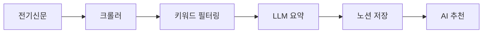
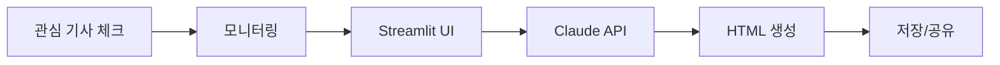

# 🔌 전력산업 뉴스 크롤링 & 카드뉴스 자동화 통합 가이드

## 📅 최종 업데이트: 2025-06-10

---

## 🎯 프로젝트 개요

### 📍 기본 정보
- **프로젝트명**: AI-Agent-Full-Stack-Developer
- **위치**: `/home/zwtiger/AI-Agent-Full-Stack-Developer` (WSL Ubuntu)
- **GitHub**: [zwtiger04/AI-Agent-Full-Stack-Developer](https://github.com/zwtiger04/AI-Agent-Full-Stack-Developer)
- **노션 Parent Page ID**: `2002360b26038007a59fcda976552022`

### 🎯 프로젝트 목표
1. 전력산업 뉴스 자동 크롤링 (전기신문)
2. 노션 데이터베이스 자동 저장
3. AI 기반 요약 및 추천
4. 관심 기사 카드뉴스 자동 생성

---

## 🏗️ 시스템 구조

### 1️⃣ **뉴스 크롤링 시스템**



**주요 컴포넌트:**
- `main.py`: 메인 실행 파일
- `crawlers/electimes_crawler.py`: 전기신문 크롤러
- `notion/notion_client.py`: 노션 API 클라이언트
- `ai_update_content.py`: LLM 요약 생성
- `ai_recommender.py`: AI 추천 시스템

### 2️⃣ **카드뉴스 생성 시스템 (Level 2)**



**주요 컴포넌트:**
- `watch_interested_articles.py`: 관심 기사 모니터링
- `card_news_app.py`: Streamlit 웹 UI
- `run_level2.py`: 통합 실행 스크립트

---

## 🚀 빠른 시작 가이드

### 1. 환경 설정
```bash
# 1. 프로젝트 폴더로 이동
cd /home/zwtiger/AI-Agent-Full-Stack-Developer

# 2. 가상환경 활성화
source venv/bin/activate

# 3. 환경변수 설정 (.env 파일)
NOTION_API_KEY=your_notion_api_key
NOTION_PARENT_PAGE_ID=2002360b26038007a59fcda976552022
ANTHROPIC_API_KEY=your_claude_api_key
GITHUB_TOKEN=your_github_pat
OLLAMA_API_URL=http://localhost:11434/v1/chat/completions
```

### 2. 뉴스 크롤링 실행
```bash
# 기본 크롤링 (규칙 기반 요약)
python main.py

# LLM 요약 활성화 (선택사항)
# ai_update_content.py에서 use_llm=True로 변경
```

### 3. 카드뉴스 생성 (Level 2)
```bash
# 전체 시스템 실행
python3 run_level2.py

# 또는 개별 실행
# 1) 모니터링만
python3 watch_interested_articles.py

# 2) UI만
streamlit run card_news_app.py
```

---

## 📊 주요 기능

### 🔍 크롤링 기능
- **대상**: 전기신문 (electimes.com)
- **필터링**: 
  - 최근 3일 이내 기사
  - 키워드 매칭 (재생에너지, VPP, ESS, 태양광 등)
  - AI 추천 모델 필터링

### 📝 노션 연동
- **주차별 데이터베이스 자동 생성**
  - 형식: "전력 산업 뉴스 YYYY년 WW주차"
- **저장 필드**:
  - 제목, 출처, 날짜, 키워드
  - 한줄요약, 핵심 내용
  - 바로가기 URL
  - 관심/AI추천 체크박스

### 🎨 카드뉴스 생성
- **트리거**: 노션에서 "관심" 체크한 기사
- **생성 방식**: Claude API 활용
- **비용**: 기사당 약 $0.555 (750원)
- **안전장치**: 
  - 일일 한도 $10
  - 월간 한도 $50
  - 사전 비용 고지

### 🤖 AI 기능
- **요약 생성**: 
  - 규칙 기반 (기본)
  - LLM 기반 (Ollama + Gemma2)
- **추천 시스템**: 
  - 사용자 관심 기사 학습
  - LogisticRegression 모델

---

## 📁 프로젝트 구조

```
AI-Agent-Full-Stack-Developer/
├── 📄 설정 파일
│   ├── .env                    # API 키 및 환경변수
│   ├── requirements.txt        # Python 패키지
│   └── .gitignore             # Git 제외 파일
│
├── 🐍 메인 스크립트
│   ├── main.py                # 크롤링 메인
│   ├── run_level2.py          # 카드뉴스 통합 실행
│   └── test_*.py              # 각종 테스트 스크립트
│
├── 📦 모듈
│   ├── crawlers/              # 크롤러 모듈
│   ├── notion/                # 노션 연동
│   ├── processors/            # 데이터 처리
│   └── recommenders/          # AI 추천
│
├── 🎨 카드뉴스
│   ├── card_news_app.py       # Streamlit UI
│   ├── watch_interested_articles.py  # 모니터링
│   └── card_news/             # 생성된 카드뉴스
│
├── 📊 데이터
│   ├── feedback/              # AI 모델 데이터
│   ├── logs/                  # 실행 로그
│   ├── pending_cardnews.json  # 대기 중인 기사
│   └── cost_tracking.json     # 비용 추적
│
└── 📚 문서
    └── INTEGRATED_PROJECT_GUIDE.md  # 이 문서
```

---

## 🔧 주요 키워드

```python
KEYWORDS = [
    '재생에너지', '전력중개사업', 'VPP', '전력시장', 'ESS', 
    '출력제어', '중앙계약', '저탄소 용량', '재생에너지입찰', 
    '보조서비스', '예비력시장', '하향예비력', '계통포화',
    '전력망', '기후에너지부', '태양광', '전력감독원',
    '풍력', '해상풍력', '전력가격', 'SMP'
]
```

---

## 💰 비용 관리

### Claude API 비용
- **입력**: $15 / 1M tokens
- **출력**: $75 / 1M tokens
- **기사당 예상**: $0.555 (약 750원)
- **월간 예산**: $50 (약 68,500원)

### 비용 절감 팁
1. 템플릿 재사용
2. 일괄 처리
3. 선별적 생성
4. 캐싱 활용

---

## 🐛 문제 해결

### 1. 크롤링 오류
```bash
# Selenium 드라이버 확인
which chromedriver

# 로그 확인
tail -f logs/crawler_*.log
```

### 2. 노션 연동 오류
```bash
# API 키 확인
echo $NOTION_API_KEY

# 권한 확인 (노션에서 통합 권한 설정)
```

### 3. 카드뉴스 생성 오류
```bash
# Streamlit 포트 확인
lsof -i :8501

# API 키 확인
echo $ANTHROPIC_API_KEY
```

---

## 📈 향후 계획

### 단기 (1개월)
- [ ] 다양한 뉴스 소스 추가
- [ ] 크롤링 스케줄러 구현
- [ ] 카드뉴스 템플릿 확장

### 중기 (3개월)
- [ ] AI 모델 고도화
- [ ] 자동 보고서 생성
- [ ] 웹 대시보드 구축

### 장기 (6개월)
- [ ] 다국어 지원
- [ ] 실시간 모니터링
- [ ] API 서비스화

---

## 📞 참고 사항

### 주요 링크
- **노션 데이터베이스**: [전력 산업 뉴스](https://notion.so/...)
- **GitHub**: [프로젝트 저장소](https://github.com/zwtiger04/AI-Agent-Full-Stack-Developer)
- **전기신문**: [electimes.com](https://www.electimes.com)

### API 문서
- [Notion API](https://developers.notion.com)
- [Anthropic API](https://docs.anthropic.com)
- [Ollama](https://ollama.ai)

---

## 🔒 보안 주의사항

1. **절대 `.env` 파일을 Git에 커밋하지 마세요!**
2. API 키 노출 시 즉시 재발급
3. 공개 저장소에서는 더미 데이터 사용
4. 정기적인 API 키 로테이션

---

*이 문서는 프로젝트의 모든 MD 파일을 통합하여 작성되었습니다.*
*불필요한 중복 문서는 삭제하고 이 문서를 참고하세요.*