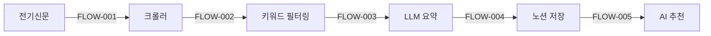
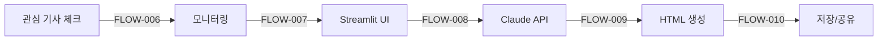

# 🔌 전력산업 뉴스 크롤링 & 카드뉴스 자동화 통합 가이드

## 📅 최종 업데이트: 2025-06-15

---

## 🎯 프로젝트 개요

### 📍 기본 정보
- **프로젝트 ID**: PWR-NEWS-001
- **프로젝트명**: AI-Agent-Full-Stack-Developer
- **위치**: `/home/zwtiger/AI-Agent-Full-Stack-Developer` (WSL Ubuntu)
- **GitHub**: [zwtiger04/AI-Agent-Full-Stack-Developer](https://github.com/zwtiger04/AI-Agent-Full-Stack-Developer)
- **노션 Parent Page ID**: `2002360b26038007a59fcda976552022`

### 🎯 프로젝트 목표
1. 전력산업 뉴스 자동 크롤링 (전기신문)
2. 노션 데이터베이스 자동 저장
3. AI 기반 요약 및 추천
4. 관심 기사 카드뉴스 자동 생성

---

## 🏗️ 시스템 구조 (ID 추적 체계)

### 시스템 컴포넌트 ID 체계
- **SYS-XXX-NNN**: 시스템 레벨 컴포넌트
- **MOD-XXX-NNN**: 모듈 레벨 컴포넌트
- **FLOW-NNN**: 프로세스 플로우
- **TASK-XXX-NNN**: 작업 태스크
- **ISSUE-NNN**: 이슈 및 버그
- **FILE-XXX-NNN**: 파일 참조
- **DIR-XXX-NNN**: 디렉토리 참조

### 1️⃣ **뉴스 크롤링 시스템** [SYS-CRAWLER-001]



**주요 컴포넌트:**
- `main.py` [MOD-MAIN-001]: 메인 실행 파일
- `crawlers/electimes_crawler.py` [MOD-CRAWLER-001]: 전기신문 크롤러
- `notion/notion_client.py` [MOD-NOTION-001]: 노션 API 클라이언트
- `ai_update_content.py` [MOD-AI-CONTENT-001]: LLM 요약 생성
- `ai_recommender.py` [MOD-AI-REC-001]: AI 추천 시스템

### 2️⃣ **카드뉴스 생성 시스템** [SYS-CARDNEWS-001]



**주요 컴포넌트:**
- `watch_interested_articles.py` [MOD-WATCH-001]: 관심 기사 모니터링
- `card_news_app_integrated.py` [MOD-CARDNEWS-MAIN-001]: Streamlit 웹 UI
- `run_level2.py` [MOD-RUN-001]: 통합 실행 스크립트

**카드뉴스 서브 모듈:**
- `card_news/section_config.py` [MOD-SECTION-CONFIG-001]: 섹션 설정
- `card_news/section_selector.py` [MOD-SECTION-SEL-001]: 섹션 선택기
- `card_news/section_analytics.py` [MOD-SECTION-ANAL-001]: 섹션 분석
- `card_news/analytics_integration.py` [MOD-ANAL-INT-001]: 분석 통합

---

## 🚀 빠른 시작 가이드

### 1. 환경 설정 [TASK-ENV-001]
```bash
# 1. 프로젝트 폴더로 이동
cd /home/zwtiger/AI-Agent-Full-Stack-Developer

# 2. 가상환경 활성화
source venv/bin/activate

# 3. 환경변수 설정 (.env 파일)
NOTION_API_KEY=your_notion_api_key
NOTION_PARENT_PAGE_ID=2002360b26038007a59fcda976552022
ANTHROPIC_API_KEY=your_claude_api_key
GITHUB_TOKEN=your_github_pat
OLLAMA_API_URL=http://localhost:11434/v1/chat/completions
```

### 2. 뉴스 크롤링 실행 [TASK-CRAWL-001]
```bash
# 기본 크롤링 (규칙 기반 요약)
python main.py

# LLM 요약 활성화 (선택사항)
# ai_update_content.py에서 use_llm=True로 변경
```

### 3. 카드뉴스 생성 [TASK-CARDNEWS-001]
```bash
# Streamlit UI 실행
streamlit run card_news_app_integrated.py --server.port 8501 --server.address 0.0.0.0

# 또는 전체 시스템 실행 (deprecated)
python3 run_level2.py
```

---

## 📊 작업 추적 시스템

### 완료된 작업 [TASK-COMPLETED]

#### 2025-06-15 작업 내역
1. **[TASK-COMP-001]** 환경변수 로드 오류 수정
   - 문제: `load_dotenv()` 누락
   - 해결: import 및 호출 추가
   - 상태: ✅ 완료

2. **[TASK-COMP-002]** 메서드 이름 불일치 해결
   - 수정 사항:
     - `get_section_by_id` → `get_section_info`
     - `get_section_names` → `get_all_sections`
     - `analyze_keyword_section_correlation` → `get_keyword_section_correlation`
   - 상태: ✅ 완료

3. **[TASK-COMP-003]** UI 구조 오류 수정
   - 중첩된 expander 제거
   - correlation matrix 데이터 형식 수정
   - 상태: ✅ 완료

4. **[TASK-COMP-004]** 빈 키워드 처리
   - 기본값 "전력산업" 설정
   - 상태: ✅ 완료

### 진행중인 작업 [TASK-INPROGRESS]
- 없음 (현재 시스템 정상 작동 중)

### 예정된 작업 [TASK-PLANNED]

#### 단기 (1주일)
1. **[TASK-PLAN-001]** 에러 핸들링 강화
   - 각 모듈에 try-except 추가
   - 로깅 시스템 개선

2. **[TASK-PLAN-002]** 테스트 코드 작성
   - 단위 테스트
   - 통합 테스트

#### 중기 (1개월)
3. **[TASK-PLAN-003]** 크롤러 확장
   - 추가 뉴스 소스
   - RSS 피드 지원

4. **[TASK-PLAN-004]** UI/UX 개선
   - 반응형 디자인
   - 더 나은 시각화

#### 장기 (3개월)
5. **[TASK-PLAN-005]** API 서비스화
6. **[TASK-PLAN-006]** 모바일 앱 개발
7. **[TASK-PLAN-007]** 다국어 지원

---

## 💾 백업 관리

### 백업 정책 [BACKUP-POLICY-001]
- 주요 변경사항 발생 시 백업
- 백업 위치: `backups/backup_YYYYMMDD_HHMMSS/`
- 보관 기간: 30일

### 최신 백업 정보 [BACKUP-LATEST]
```yaml
backup_id: BACKUP-20250615-114534
date: 2025-06-15 11:45:34
location: /home/zwtiger/AI-Agent-Full-Stack-Developer/backups/backup_20250615_114534/
contents:
  - 모든 Python 파일 (*.py)
  - 모든 설정 파일 (.env, *.json)
  - 모든 문서 파일 (*.md)
  - card_news 디렉토리 전체
size: 약 1.3MB
files_count: 50+
```

### 백업 복원 명령
```bash
# 백업 목록 확인
ls -la backups/

# 특정 백업 복원
cp -r backups/backup_20250615_114534/* ./
```

---

## 📁 프로젝트 구조 (ID 매핑)

```
AI-Agent-Full-Stack-Developer/ [DIR-ROOT-001]
├── 📄 설정 파일
│   ├── .env [FILE-ENV-001]                    # API 키 및 환경변수
│   ├── requirements.txt [FILE-REQ-001]        # Python 패키지
│   └── .gitignore [FILE-GIT-001]              # Git 제외 파일
│
├── 🐍 메인 스크립트
│   ├── main.py [MOD-MAIN-001]                 # 크롤링 메인
│   ├── card_news_app_integrated.py [MOD-CARDNEWS-MAIN-001] # 카드뉴스 UI
│   └── test_*.py [MOD-TEST-XXX]               # 각종 테스트 스크립트
│
├── 📦 모듈
│   ├── crawlers/ [DIR-CRAWLERS-001]           # 크롤러 모듈
│   ├── notion/ [DIR-NOTION-001]               # 노션 연동
│   ├── processors/ [DIR-PROCESSORS-001]       # 데이터 처리
│   ├── recommenders/ [DIR-RECOMMENDERS-001]   # AI 추천
│   └── card_news/ [DIR-CARDNEWS-001]          # 카드뉴스 모듈
│       ├── section_config.py [MOD-SECTION-CONFIG-001]
│       ├── section_selector.py [MOD-SECTION-SEL-001]
│       ├── section_analytics.py [MOD-SECTION-ANAL-001]
│       └── analytics_integration.py [MOD-ANAL-INT-001]
│
├── 📊 데이터
│   ├── feedback/ [DIR-FEEDBACK-001]           # AI 모델 데이터
│   ├── logs/ [DIR-LOGS-001]                   # 실행 로그
│   ├── pending_cardnews.json [FILE-PENDING-001] # 대기 중인 기사
│   └── cost_tracking.json [FILE-COST-001]     # 비용 추적
│
├── 💾 백업
│   └── backups/ [DIR-BACKUPS-001]             # 백업 파일들
│       └── backup_20250615_114534/ [BACKUP-20250615-114534]
│
└── 📚 문서
    ├── README.md [DOC-README-001]             # 프로젝트 개요
    ├── INTEGRATED_PROJECT_GUIDE.md [DOC-GUIDE-001] # 이 문서
    └── *.md [DOC-XXX-NNN]                     # 기타 문서들
```

---

## 🔧 주요 키워드 [KEYWORDS-001]

```python
KEYWORDS = [
    '재생에너지', '전력중개사업', 'VPP', '전력시장', 'ESS', 
    '출력제어', '중앙계약', '저탄소 용량', '재생에너지입찰', 
    '보조서비스', '예비력시장', '하향예비력', '계통포화',
    '전력망', '기후에너지부', '태양광', '전력감독원',
    '풍력', '해상풍력', '전력가격', 'SMP'
]
```

---

## 💰 비용 관리 [COST-MANAGEMENT-001]

### Claude API 비용
- **입력**: $15 / 1M tokens
- **출력**: $75 / 1M tokens
- **기사당 예상**: $0.555 (약 750원)
- **월간 예산**: $50 (약 68,500원)

### 비용 절감 팁
1. 템플릿 재사용
2. 일괄 처리
3. 선별적 생성
4. 캐싱 활용

---

## 🐛 문제 해결 가이드 [TROUBLESHOOT-001]

### 1. 크롤링 오류 [ISSUE-CRAWL-XXX]
```bash
# Selenium 드라이버 확인
which chromedriver

# 로그 확인
tail -f logs/crawler_*.log
```

### 2. 노션 연동 오류 [ISSUE-NOTION-XXX]
```bash
# API 키 확인
echo $NOTION_API_KEY

# 권한 확인 (노션에서 통합 권한 설정)
```

### 3. 카드뉴스 생성 오류 [ISSUE-CARDNEWS-XXX]
```bash
# Streamlit 포트 확인
lsof -i :8501

# API 키 확인
echo $ANTHROPIC_API_KEY

# 프로세스 재시작
pkill -f streamlit
streamlit run card_news_app_integrated.py --server.port 8501
```

---

## 📈 향후 계획 [ROADMAP-001]

### Phase 1: 안정화 (2025년 6월)
- [x] 시스템 오류 수정
- [ ] 테스트 코드 작성
- [ ] 문서화 완료

### Phase 2: 확장 (2025년 7월)
- [ ] 추가 뉴스 소스
- [ ] UI/UX 개선
- [ ] 성능 최적화

### Phase 3: 고도화 (2025년 8월)
- [ ] API 서비스화
- [ ] 대시보드 강화
- [ ] 자동화 확대

---

## 📞 참고 사항

### 주요 링크
- **노션 데이터베이스**: [전력 산업 뉴스](https://notion.so/...)
- **GitHub**: [프로젝트 저장소](https://github.com/zwtiger04/AI-Agent-Full-Stack-Developer)
- **전기신문**: [electimes.com](https://www.electimes.com)

### API 문서
- [Notion API](https://developers.notion.com)
- [Anthropic API](https://docs.anthropic.com)
- [Ollama](https://ollama.ai)

---

## 🔒 보안 주의사항

1. **절대 `.env` 파일을 Git에 커밋하지 마세요!**
2. API 키 노출 시 즉시 재발급
3. 공개 저장소에서는 더미 데이터 사용
4. 정기적인 API 키 로테이션

---

*이 문서는 프로젝트의 모든 측면을 ID 기반으로 추적 관리하기 위해 작성되었습니다.*
*문서 버전: 2.0 (2025-06-15)*
