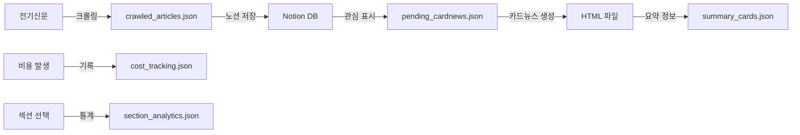

# 📄 JSON 파일 문서화

## 🗂️ 전체 JSON 파일 구조

```
data/card_news/json/
├── cost_tracking.json       # API 비용 추적
├── crawled_articles.json    # 크롤링된 원본 기사
├── pending_cardnews.json    # 카드뉴스 생성 대기 목록
├── section_analytics.json   # 섹션 분석 통계
└── summary_cards.json       # 생성된 카드뉴스 요약 정보
```

---

## 📊 각 JSON 파일 상세 설명

### 1. cost_tracking.json
- **ID**: JSON-001
- **위치**: `data/card_news/json/cost_tracking.json`
- **목적**: Claude API 사용 비용 추적 및 한도 관리
- **구조**:
```json
{
  "2025-06-15": {
    "requests": 2,
    "total_cost": 1.11
  }
}
```
- **참조하는 곳**:
  - `CostManager` 클래스 (`card_news_app.py`)
  - 비용 관리 탭에서 일일/월간 비용 계산
- **업데이트 시점**: 카드뉴스 생성 시마다

---

### 2. crawled_articles.json
- **ID**: JSON-002
- **위치**: `data/card_news/json/crawled_articles.json`
- **목적**: 전기신문에서 크롤링한 원본 기사 저장
- **구조**:
```json
[
  {
    "title": "기사 제목",
    "url": "https://www.electimes.com/...",
    "date": "2025-06-15",
    "content": "기사 본문"
  }
]
```
- **참조하는 곳**:
  - `main.py` (크롤링 시스템)
  - 초기 데이터 수집 단계
- **업데이트 시점**: 크롤링 실행 시

---

### 3. pending_cardnews.json ⚠️
- **ID**: JSON-003
- **위치**: `data/card_news/json/pending_cardnews.json`
- **목적**: 노션에서 "관심" 표시된 기사 중 카드뉴스 생성 대기 목록
- **구조**:
```json
[
  {
    "page_id": "노션 페이지 ID",
    "title": "기사 제목",
    "url": "원문 링크",
    "summary": "AI가 생성한 요약",
    "content": "핵심 내용 (bullet points)",
    "keywords": ["재생에너지", "ESS", "태양광"],
    "interest": true,
    "ai_recommend": false
  }
]
```
- **참조하는 곳**:
  - `watch_interested_articles.py` (모니터링)
  - `load_interested_articles()` 함수
  - ❌ `load_generated_card_news()` - 실수로 사용했던 곳
- **업데이트 시점**: 노션 모니터링 시

---

### 4. section_analytics.json
- **ID**: JSON-004
- **위치**: `data/card_news/json/section_analytics.json`
- **목적**: 카드뉴스 섹션별 사용 통계 (어떤 섹션이 자주 선택되는지)
- **구조**:
```json
{
  "재생에너지": {
    "배경 및 맥락": 5,
    "비즈니스 영향": 3
  }
}
```
- **참조하는 곳**:
  - `SectionAnalytics` 클래스
  - 분석 대시보드 탭
- **업데이트 시점**: 섹션 선택 시마다

---

### 5. summary_cards.json ⭐
- **ID**: JSON-005
- **위치**: `data/card_news/json/summary_cards.json`
- **목적**: 생성된 카드뉴스들의 요약 정보 (요약 페이지용)
- **구조**:
```json
{
  "cards": [
    {
      "id": "detail_제목_날짜",
      "title": "카드뉴스 제목",
      "summary": "실제 요약 내용",
      "keywords": ["태양광", "솔라"],
      "date": "2025-06-16",
      "file_path": "detail_xxx.html",
      "category": "태양광",
      "added_date": "2025-06-16T23:22:49"
    }
  ]
}
```
- **참조하는 곳**:
  - ✅ `load_generated_card_news()` - 올바른 사용처
  - `update_summary.py` (업데이트 스크립트)
  - 요약 카드뉴스 탭
- **업데이트 시점**: 카드뉴스 생성 완료 시

---

## 🔄 데이터 플로우 다이어그램



---

## ⚠️ 주의사항

### 혼동하기 쉬운 부분
1. **pending_cardnews.json vs summary_cards.json**
   - `pending`: 생성 전 대기 목록 (노션 데이터)
   - `summary`: 생성 완료된 카드뉴스 정보
   
2. **crawled_articles.json vs pending_cardnews.json**
   - `crawled`: 모든 크롤링된 기사
   - `pending`: 관심 표시된 기사만

### 파일 크기 관리
- `pending_cardnews.json`: 69KB (가장 큼)
- 주기적인 정리 필요
- 백업 권장

---

## 📝 코드에서 사용 예시

```python
# ✅ 올바른 사용
# 요약 페이지에서 카드뉴스 목록 로드
with open('data/card_news/json/summary_cards.json', 'r') as f:
    data = json.load(f)
    cards = data.get('cards', [])

# ❌ 잘못된 사용 (혼동 주의!)
# pending_cardnews.json은 생성 대기 목록
with open('data/card_news/json/pending_cardnews.json', 'r') as f:
    # 이건 아직 생성되지 않은 기사들!
```

---

*문서 생성: 2025-06-17*
*최종 업데이트: load_generated_card_news() 함수 수정 관련*
