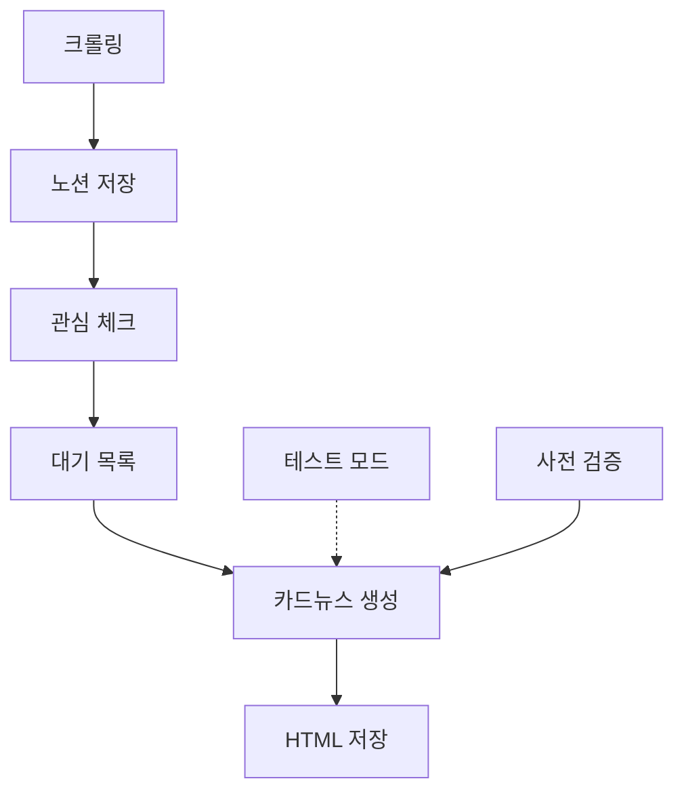

# 🔌 전력산업 뉴스 카드뉴스 자동화 시스템 업데이트 로그

## 📅 작성일: 2025-06-15
## 👤 작성자: KJ & Claude

---

## 🏗️ 시스템 구조 (ID 기준)

### [SYS-001] 메인 시스템 구조
```
AI-Agent-Full-Stack-Developer/
├── [MOD-001] 크롤링 시스템
│   ├── main.py - 메인 실행
│   ├── crawlers/electimes_crawler.py - 전기신문 크롤러
│   └── ai_recommender.py - AI 추천 시스템
│
├── [MOD-002] 노션 연동 시스템
│   └── notion/notion_client.py - 노션 API 클라이언트
│
├── [MOD-003] 카드뉴스 생성 시스템
│   ├── card_news_app_integrated.py - Streamlit 통합 앱
│   ├── watch_interested_articles.py - 관심 기사 모니터링
│   └── run_level2.py - 통합 실행 스크립트
│
├── [MOD-004] 카드뉴스 모듈
│   ├── card_news/
│   │   ├── card_news_generator.py - 생성기
│   │   ├── section_selector.py - 섹션 선택기
│   │   ├── section_config.py - 섹션 설정
│   │   ├── section_analytics.py - 분석 모듈
│   │   └── test_mode_generator.py - 테스트 모드 (NEW)
│   │
│   └── [MOD-005] 검증 시스템 (NEW)
│       ├── validate_before_api.py - API 호출 전 검증
│       └── test_cardnews_safe.py - 안전 테스트
│
└── [MOD-006] 데이터 및 로그
    ├── pending_cardnews.json - 대기 중인 기사
    ├── cost_tracking.json - 비용 추적
    └── logs/ - 실행 로그
```

### [FLOW-001] 전체 시스템 플로우


---

## 📋 작업 히스토리 (시간순)

### [TASK-001] 카드뉴스 생성 오류 수정 (12:05)
- **문제**: `KeyError: 'id'` - article 구조에 'id' 필드 없음
- **해결**: `article['id']` → `article['page_id']` 변경
- **상태**: ✅ 완료

### [TASK-002] section_selector.py 오류 수정 (12:15)
- **문제**: `ValueError: too many values to unpack (expected 2)`
- **원인**: emphasis 데이터가 다양한 형식으로 전달됨
- **해결**: 
  ```python
  # 다양한 형식 처리 코드 추가
  if isinstance(section, str):
      section_id = section
  elif isinstance(section, (tuple, list)):
      section_id = section[0]
  elif isinstance(section, dict):
      section_id = section.get('id', section.get('section_id', ''))
  ```
- **상태**: ✅ 완료

### [TASK-003] API 호출 전 검증 시스템 구축 (12:20)
- **목적**: 비용 발생 전 오류 방지
- **구현**:
  - `validate_before_api.py`: 검증 모듈
  - `test_cardnews_safe.py`: 안전 테스트 스크립트
  - `check_before_generate.sh`: 간편 실행 스크립트
- **검증 항목**:
  1. API 키 확인
  2. 기사 데이터 구조 검증
  3. emphasis 형식 검증 및 정규화
  4. 비용 한도 확인
- **상태**: ✅ 완료

### [TASK-004] Streamlit 테스트 모드 추가 (14:00)
- **목적**: API 호출 없이 전체 프로세스 테스트
- **구현**:
  - `test_mode_generator.py`: 더미 HTML 생성기
  - Streamlit UI에 테스트 모드 토글 추가
  - 3가지 템플릿 (미니멀, 모던, 프로페셔널)
- **특징**:
  - 비용: $0.00
  - 즉시 생성
  - 시각적 테스트 표시
- **상태**: ✅ 완료

### [TASK-005] 현재 오류 (14:30)
- **문제**: `TypeError: unhashable type: 'list'`
- **위치**: card_news_app_integrated.py
- **추정 원인**: emphasis가 리스트 형태로 전달될 때 해싱 불가능한 타입 오류
- **상태**: ❌ 해결 필요

---

## 🎯 향후 계획

### [PLAN-001] 즉시 해결 필요
1. TypeError 오류 수정
2. emphasis 데이터 타입 일관성 확보
3. 테스트 모드 안정화

### [PLAN-002] 단기 개선 (1주)
1. 오류 로깅 시스템 강화
2. 사용자 피드백 UI 개선
3. 배치 처리 기능 추가

### [PLAN-003] 중기 개선 (1개월)
1. 다양한 뉴스 소스 추가
2. 카드뉴스 템플릿 확장
3. 자동 스케줄링 기능

---

## 🐛 현재 이슈

### [ISSUE-001] TypeError: unhashable type: 'list'
- **발생 시점**: 카드뉴스 생성 시도 시
- **오류 메시지**: `TypeError: unhashable type: 'list'`
- **추정 원인**: 
  - emphasis가 리스트로 전달되어 딕셔너리 키나 set에 사용 시 오류
  - section_analytics.py에서 emphasis를 키로 사용하는 부분 존재 가능
- **해결 방향**:
  1. emphasis를 튜플이나 문자열로 변환
  2. 해싱이 필요한 부분 확인 및 수정

---

## 💰 비용 현황
- **6월 15일**: $0.555 (1건)
- **6월 누적**: $7.215
- **일일 한도**: $10.00
- **월간 한도**: $50.00

---

## 🔧 환경 정보
- **위치**: WSL Ubuntu - `/home/zwtiger/AI-Agent-Full-Stack-Developer`
- **Python**: 3.10 (venv 사용)
- **주요 패키지**: streamlit, anthropic, notion-client
- **포트**: 8501 (Streamlit)

---

## 📌 중요 파일 위치
- **메인 앱**: `card_news_app_integrated.py`
- **테스트 스크립트**: `test_cardnews_safe.py`
- **검증 모듈**: `validate_before_api.py`
- **테스트 모드**: `card_news/test_mode_generator.py`
- **비용 추적**: `cost_tracking.json`
- **대기 기사**: `pending_cardnews.json`

---

*이 문서는 2025-06-15 14:30 기준으로 작성되었습니다.*
