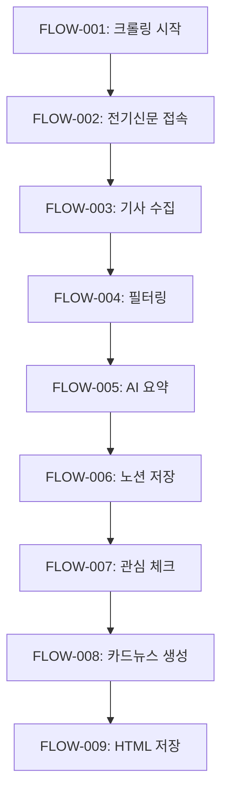

# 🔌 전력산업 뉴스 크롤러 & 카드뉴스 자동화 시스템

## 📋 프로젝트 개요
- **프로젝트 ID**: PWR-NEWS-001
- **목적**: 전력산업 관련 뉴스를 자동으로 수집하여 노션(Notion)에 정리하고 카드뉴스로 제작하는 통합 시스템
- **환경**: WSL (Windows Subsystem for Linux) - Ubuntu
- **위치**: `/home/zwtiger/AI-Agent-Full-Stack-Developer`
- **최종 업데이트**: 2025년 6월 15일

## 🏗️ 시스템 구성 (ID 기반 추적)

### 1. 뉴스 크롤러 시스템 [SYS-CRAWLER-001]
- **ID**: SYS-CRAWLER-001
- **구성요소**:
  - `main.py` [MOD-MAIN-001]: 메인 크롤러 실행
  - `crawlers/electimes_crawler.py` [MOD-CRAWLER-001]: 전기신문 크롤러
  - `ai_recommender.py` [MOD-AI-REC-001]: AI 추천 시스템
- **기능**:
  - 전기신문(electimes.com) 자동 크롤링
  - 최근 3일 이내 기사 필터링
  - 키워드 기반 선별 (재생에너지, VPP, ESS 등)
  - AI 추천 시스템 (사용자 피드백 학습)

### 2. 노션 연동 시스템 [SYS-NOTION-001]
- **ID**: SYS-NOTION-001
- **구성요소**:
  - `notion/notion_client.py` [MOD-NOTION-001]: 노션 API 클라이언트
  - `ai_update_content.py` [MOD-AI-CONTENT-001]: AI 요약 생성
- **기능**:
  - 주차별 데이터베이스 자동 생성
  - 기사 요약 및 핵심 내용 자동 생성
  - 중복 방지 및 업데이트 관리

### 3. 카드뉴스 제작 시스템 [SYS-CARDNEWS-001]
- **ID**: SYS-CARDNEWS-001
- **메인 모듈**: `card_news_app_integrated.py` [MOD-CARDNEWS-MAIN-001]
- **서브 모듈**:
  - `card_news/section_config.py` [MOD-SECTION-CONFIG-001]: 섹션 설정
  - `card_news/section_selector.py` [MOD-SECTION-SEL-001]: 섹션 선택기
  - `card_news/section_analytics.py` [MOD-SECTION-ANAL-001]: 섹션 분석
  - `card_news/analytics_integration.py` [MOD-ANAL-INT-001]: 분석 통합
- **기능**:
  - Streamlit 기반 웹 UI
  - Claude AI를 활용한 HTML 카드뉴스 생성
  - 섹션 추천 및 최적화
  - 비용 관리 및 안전장치 포함

## 📊 시스템 플로우 (ID 기반)




> ⚠️ **경로 변경 안내**
> - 기존: 프로젝트 루트에 JSON 파일 저장
> - 변경: `data/card_news/json/` 디렉토리에 모든 데이터 저장
> - 기존: `/mnt/c/Users/KJ/Desktop/` Windows 경로 사용
> - 변경: `output/card_news/html/` 프로젝트 내부 경로 사용

## 🚀 빠른 시작 가이드

### 1️⃣ 환경 설정 [TASK-ENV-001]
```bash
# 프로젝트 폴더로 이동
cd /home/zwtiger/AI-Agent-Full-Stack-Developer

# 가상환경 활성화
source venv/bin/activate

# 환경변수 설정 확인
cat .env
```

### 2️⃣ 기본 크롤링 실행 [TASK-CRAWL-001]
```bash
# 뉴스 크롤링 및 노션 동기화
python main.py
```

### 3️⃣ 카드뉴스 생성 [TASK-CARDNEWS-001]
```bash
# Streamlit UI 실행
streamlit run card_news_app_integrated.py --server.port 8501 --server.address 0.0.0.0
```

## 🛠️ 최근 작업 내역 (2025-06-15)

### 해결된 이슈 [ISSUE-RESOLVED]
1. **[ISSUE-001]** `load_dotenv()` 누락으로 인한 환경변수 미로드
   - **해결**: dotenv import 및 호출 추가
   
2. **[ISSUE-002]** 메서드 이름 불일치 오류들
   - `get_section_by_id` → `get_section_info`
   - `get_section_names` → `get_all_sections`
   - `analyze_keyword_section_correlation` → `get_keyword_section_correlation`
   
3. **[ISSUE-003]** Streamlit UI 구조 오류
   - 중첩된 expander 제거
   - correlation matrix 데이터 형식 수정
   
4. **[ISSUE-004]** 빈 키워드 리스트 처리
   - 기본값 "전력산업" 설정

### 현재 상태 [STATUS-CURRENT]
- ✅ 시스템 정상 작동 중
- ✅ 34개 관심 기사 로드됨
- ✅ 섹션 추천 기능 정상 작동
- ✅ 분석 대시보드 정상 표시

## 📅 향후 작업 계획 [TASK-FUTURE]

### 단기 (1주일) [TASK-WEEK-001]
1. **[TASK-001]** 에러 핸들링 강화
   - try-except 블록 추가
   - 명확한 에러 메시지
   
2. **[TASK-002]** 테스트 코드 작성
   - 단위 테스트
   - 통합 테스트

### 중기 (1개월) [TASK-MONTH-001]
1. **[TASK-003]** 크롤러 확장
   - 추가 뉴스 소스
   - RSS 피드 지원
   
2. **[TASK-004]** UI/UX 개선
   - 반응형 디자인
   - 더 나은 시각화

### 장기 (3개월) [TASK-QUARTER-001]
1. **[TASK-005]** API 서비스화
2. **[TASK-006]** 모바일 앱 개발
3. **[TASK-007]** 다국어 지원

## 💾 백업 정보

### 최신 백업 [BACKUP-001]
- **날짜**: 2025-06-15 11:45:34
- **위치**: `/home/zwtiger/AI-Agent-Full-Stack-Developer/backups/backup_20250615_114534/`
- **포함 내용**:
  - 모든 Python 파일 (*.py)
  - 모든 설정 파일 (.env, *.json)
  - 모든 문서 파일 (*.md)
  - card_news 디렉토리 전체

### 백업 확인 명령
```bash
ls -la backups/backup_20250615_114534/
```

## 📁 프로젝트 구조

> ⚠️ **중요**: 2025-06-15 경로 구조가 표준화되었습니다. 자세한 내용은 [PATH_STRUCTURE_GUIDE.md](PATH_STRUCTURE_GUIDE.md)를 참조하세요.

```
AI-Agent-Full-Stack-Developer/
├── main.py                    # 메인 크롤러 실행
├── run_level2.py             # 카드뉴스 자동화 실행
├── card_news_app.py          # Streamlit UI
├── card_news_paths.py        # 🆕 경로 관리 모듈
├── watch_interested_articles.py  # 관심 기사 모니터링
├── crawlers/                 # 크롤러 모듈
│   └── electimes_crawler.py  # 전기신문 크롤러
├── notion/                   # 노션 연동
│   └── notion_client.py      # 노션 API 클라이언트
├── data/card_news/          # 🆕 표준화된 데이터 디렉토리
│   ├── json/                # JSON 데이터 파일
│   └── analytics/           # 분석 데이터
├── output/card_news/        # 🆕 표준화된 출력 디렉토리
│   └── html/                # 생성된 카드뉴스
├── backup/card_news/        # 🆕 자동 백업
├── logs/card_news/          # 🆕 실행 로그
├── config/                  # 🆕 설정 파일
│   └── paths.json           # 경로 설정
└── .env                     # 환경변수 (API 키)
```

## 🔧 환경변수 설정

`.env` 파일 필수 항목:
```bash
# 노션 설정 [ENV-NOTION]
NOTION_API_KEY=secret_xxxxx
NOTION_PARENT_PAGE_ID=2002360b26038007a59fcda976552022

# AI API [ENV-AI]
ANTHROPIC_API_KEY=sk-ant-xxxxx
OPENAI_API_KEY=sk-xxxxx  # 선택사항

# GitHub [ENV-GITHUB]
GITHUB_TOKEN=ghp_xxxxx

# 크롤링 설정 [ENV-CRAWL]
CRAWL_INTERVAL=3600
MAX_ARTICLES=50
```

## 📞 기술 지원
- **프로젝트 관리자**: KJ
- **개발 지원**: Claude AI (Anthropic)
- **문서 업데이트**: 2025년 6월 15일

---

⚡ **Power Industry News Automation System** - 전력산업의 미래를 함께 만들어갑니다!
